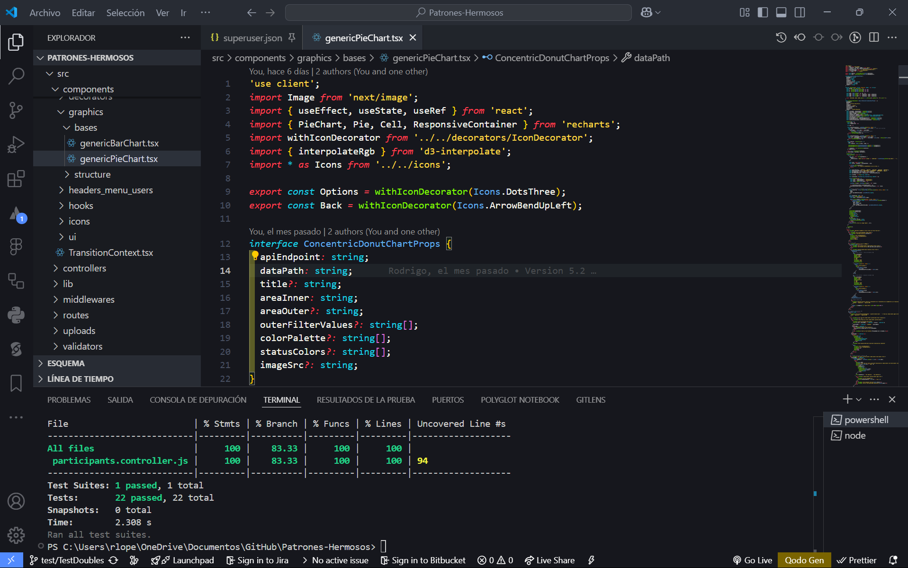

# Equipo y Participantes

**Nombre del equipo:** ByteForge 
**Integrantes:** Rodrigo López, Fernando Maggie, Alejandro Guzmán, Diego López

---

## Resumen

Se implementaron **Mocks** para simular `PrismaClient`, **Dummies** para respuestas HTTP simuladas, y **Stubs** con retornos predecibles. Esto permitió probar errores, respuestas esperadas y condiciones sin conexión a base de datos. Se aprendió a aislar lógica y cubrir casos frontera con precisión.

---

## Tabla resumen del aporte individual

| Integrante     | Tipo implementado | Archivo                                     | Descripción                                                                                                                                     | ¿Pasa pruebas? |
|----------------|--------------------|---------------------------------------------|-------------------------------------------------------------------------------------------------------------------------------------------------|----------------|
| Rodrigo López  | **Mock**           | `__tests__/participants.controller.test.js` | Se mockearon métodos de `PrismaClient` (create, findMany, findUnique, update, delete) para simular el acceso a base de datos.                  | ✅             |
| Fernando Maggie  | **Dummy**          | `__tests__/participants.controller.test.js` | Se usó una función `mockRes()` para crear objetos `Response` falsos que permiten testear el flujo HTTP sin un servidor real.                  | ✅             |
| Alejandro Guzmán / Diego López  | **Stub**           | `__tests__/participants.controller.test.js` | Algunos valores de retorno predefinidos (`mockResolvedValue`, `mockRejectedValue`) se utilizaron como stubs en lugar de lógica compleja real. | ✅             |

---

## Evidencia de ejecución

---

## Justificación sobre la estructura del repositorio

No se siguió la estructura propuesta en la segunda imagen (`/doubles/dummy`, `/doubles/stub`, `/doubles/mock`, etc.) ya que esta organización aplica mejor cuando se desarrollan archivos individuales por tipo de *Test Double* de forma explícita. En nuestro caso, el uso de *Mocks*, *Stubs* y *Dummies* se concentró en un único archivo de pruebas unificadas (`participants.controller.test.js`), alineado a la práctica común de testear por módulo o funcionalidad (por controlador en este caso). Dado que todos los test estaban relacionados a un mismo componente funcional, separarlos por tipo hubiese fragmentado el contexto y hecho más difícil su mantenimiento.