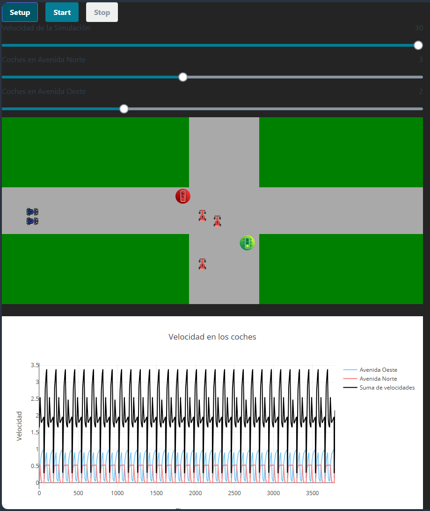

> [!NOTE]
> Los commits realizados no demuestran el trabajo realizado por los integrantes del equipo. Se trabjó de manera en conjunto y sincrónica. Dentro de este documento podrás encontrar el trabajo realizado por cada integrante.

# Modelo de Tráfico Simple

## Integrantes del Equipo

```bash
Abigail Pérez García
# A01736815
Rodrigo López Guerra
# A01737437

# ITESM Puebla
```

## Objetivo

Dentro de las ciencias de la computación es importante el poder recrear comportamientos similares a los que se viven en la vida diaria. Durante este proyecto trabajaremos un modelo de tráfico simple en donde utilizaremos un mapa con un cruce de calles, dos semáforos que siguen las normativas mexicanas y coches que nos ayudarán a simular el tráfico. Para este proyecto se dividió el avance de las siguientes maneras:

- Creación de cruces y señalamientos de semáforos
- Creación de un automóvil
- Complementación de nuestra simulación

Es importante recalcar que el proyecto planteado se está basando en el modelo de tráfico símple realizado por Uri Wilensky, realizado en Northwestern University. [Ir a la simulación.](https://tinyurl.com/237faa9a)[^1]



## ¿Cómo usarlo?

> [!WARNING]
> Recuerda antes de empezar a usar el archivo de instalar NodeJs y Julia dentro de tu sistema para evitar cualquier error relacionado a la falta de librerías de estos.

### Pasos de preparación del ambiente. 
1. Dentro de tu terminal local de NodeJs, ingresa a la ubicación de `cd ./fe` para acceder a la parte del frontend.

> [!IMPORTANT]
> Para acceder a una terminal de NodeJs, puedes realizar los comandos en una terminal local.

2. Ingresa el comando `npm install` para instalar los paquetes necesarios para correr los progrmas.
3. Ingresa el comando `npm run dev` para poder iniciar el frontend. En este punto deberías de ser capaz de ver la plataforma sin funcionar ingresando a tu navegador web a `localhost:5173`, de lo contrario, trata nuevamente a instalar los paquetes y correr el programa (o cambiar de navegador web).
4. Dentro de tu terminal local de Julia, corre el archivo llamado `webapi.jl`.

> [!IMPORTANT]
> Para acceder a una terminal de Julia, necesitas escribir desde una terminal local el comando "julia" para acceder a la misma y correr el programa desde ahí. En Visual Studio Code, puedes correr directamente el programa de "webapi.jl".

5. Ingresa desde un navegador web de tu preferencia a `localhost:5173` para hacer uso del simulador.

> [!TIP]
> Nosotros recomendamos el uso de Visual Studio Code, ya que desde esta plataforma realizamos todo lo que fue nuestro código. Es sencillo de entender y tienes un mejor manejo del código.

## Proceso de Trabajo.

### Creación de cruces y señalamientos de semáforos
Dentro de la creción de nuestra simulación desarrollamos lo que fue el mapa. Para ello, utilizamos JavaScript JSX para el FrontEnd, creando los cruces con la función de ```rect``` para su desarrollo.

> **Abigail:** Creación de Cruces Peatonales

Con ello, logramos crear una pequeña ciudad con dos calles, las cuales denominamos ***Cruce Norte*** y ***Cruce Oeste***. De ahí, implementamos un slider que nos permite controlar la velocidad de nuestras llamadas, las cuales determinan la velocidad de nuestra simulación, y con ello empezar a desarrollar los semáforos.

> **Abigail:** Creación de sistema de control de velocidades.

Durante el desarrollo implementamos dos semáforos para cada uno de nuestros cruces, en donde ***Cruce Norte*** dentro del código se denomina ```av2```, mientras que el ***Cruce Oeste*** ```av1```.

El semáforo de ```av1``` y ```av2``` se ajustó la alineación mediante el archivo de ```App.jsx```, mientras que sus cambios constantes de estado se definieron en el archivo de ```simple.jl```.

Para los diferentes cambios de nuestro semáforo utilizamos un sistema de conteo para determinar cuánto duraría el estado verde y amarillo. Nuestro estado rojo sería la suma del estado verde y amarillo. Con esta lógica se pudo unir el BackEnd con el FrontEnd para poder determinar el funcionamiento de los semáforos. De la misma manera, para sincronizar cada uno de estos, se implemento un ciclo de creación de semáforos que dependiendo de la calle en la que se encuentre nuestro semáforo será el estado en el que se encuentre. Otra solución que encontramos fue el determinar el señalamiento a través de la **ID Identificadora** del semáforo, así para que los números pares empezaran en verde, mientras que los números impares en rojo.

> **Rodrigo:** Creación de semáforos y lógica de cambio.
### Creación de un automóvil
Para la creación de un automóvil se tuvo que implementar el modelo dado anteriormente en el sample que utilizamos para poder empezar a correr dentro de nuestra simulación. Para ello se eliminaron las constantes de aceleración y detención de los coches, para poder ponerlos en el área de ```agent_step!``` de nuestros agentes tipo ```Car```, de ahí poder utilizar nuestra área de trabajo para simular 3 tipos de movimientos:
* Aceleración (Acceleration):
    - Utilizado para poder mover el coche a la dirección correspondiente de la avenida.
* Detención (Stop):
    - Utilizado para poder detener el coche en una posición específica.
* Reversa (Reverse):
    - Utilizado para poder mover el coche en la dirección contraria a la avenida.

> **Abigail:** Definición de lógica de movimiento y creación de coches.

Para la creación de movimientos utilizamos las siguientes fórmulas para que pudiera funcionar de manera apropiada nuestra simulación:

    speed = agent.street === av1 ? agent.vel[1] + 0.6 : agent.vel[2] + 2.0
    back = agent.street === av1 ? agent.vel[1] - 0.2 : agent.vel[2] - 0.6

Cada una de estas variables representan la cantidad de unidades que se le irá restando o añadiendo a la velocidad del agente dependiendo de cómo se requiera en la simulación.

> **Abigail:** Definición de "speed" y "back" para las simulaciones de movimiento.

Así se terminó de definir las velocidades de cada uno de nuestros movimientos, los cuales se definieron como:

    stop = (cos(agent.orientation)*max(back * (1-(dist_to_light<dist_to_car ? dist_to_light : dist_to_car)*(1-x)), 0.0), 0.0)  # Reduce la velocidad más lentamente

    #Stop = Agent's Rotation * Max value of (Reduction of speed * (1 - Distance to the nearest agent) * (1 - Smoothness Constant)) and 0. (ONLY ON X)

    accelerate = (cos(agent.orientation)*max(0.0, speed * (1-x/(0.3+x))), 0.0)  # Aumenta la velocidad gradualmente

    #Accelerate = Agent's Rotation * Max value of 0 and (Addition to speed * (1 - Smoothness Constant / (0.3 + Smoothness Constant))). (ONLY ON X)
    
    reverse = (cos(agent.orientation)*min(back * (1-(dist_to_light<dist_to_car ? dist_to_light : dist_to_car)*(1-x)), 1), 0.0)  # Retrocede suavemente

    #Reverse = Agent's Rotation * Min value of 1 and (Reduction to speed * (1 - Distance to the nearest agent * (1 - Smoothness Constant))). (ONLY ON X)

Cada una de estas fórmulas lógicas sigue las **Leyes de Newton** (o se trata de simular ello), haciendo que la constante de suavizado interactue con el agente como una fuerza externa que permite que el auto acelere o frene. 

De igual manera se trata de seguir las **Leyes de la Cinética** de la materia, así implementando dentro de las fórmulas la reducción o adición de la velocidad mediante ```speed``` y ```back```.

Así mismo, se analizó el **MUA (Movimiento Uniformemente Acelerado)** para poder delimitar los cambios que sufría los movimientos mediante el determinante de máximos y mínimos. *En física, cuando un cuerpo acelera de forma uniforme, su velocidad cambia a una tasa constante.* Aquí, la fórmula de aceleración lo refleja suavizando el cambio de velocidad con el término ```(1 - x / (0.3 + x))``` o ```(1-(dist_to_light<dist_to_car ? dist_to_light : dist_to_car)*(1-x)```.

Por último, agregamos una constante de rotación que nos servirá para los autos en el ***Cruce Norte***, así descomponiendo los vectores en X y en Y respectivamente para poder guiar el direccionamiento de nuestro agente.

De ahí, quisimos agregar una constante de suavizado para que las interacciones de los agentes fuera más acorde a las leyes de la física actuales utilizando la siguiente ecuación:

```Z = Z * (1 - X) + Y * X```

> [!IMPORTANT]
> - Z = Velocidad Actual.
> - Y = Nueva Velocidad Calculada.
> - X = Constante de Suavizado.

De ahí, solamente definimos la velocidad inicial de nuestro coche para que pudiera ser constante dentro de nuestra simulación de tráfico implementando las normativas del **Movimiento Rectilineo Uniforme** [MRU]

> **Rodrigo:** Implementación de lógica física y movimiento de agentes.

Después de que nuestros agentes se movieran de manera correcta, determinamos dentro de ```agent_step!``` lo que serían nuestros limitantes para el movimiento de nuestro auto. Para ello creamos funciones para que determinara la distancia entre el auto a otros autos, o semáforos e hiciera ciertas acciones para que actuara sobre nuestro agente.

Estas distancias harían que distintas acciones empezaran a correr dependiendo del tipo de circunstancia en el que se encontrara el agente actual.

> **Rodrigo:** Implementación de lógica de movimiento dentro del simulador.

### Complementación de nuestra simulación
Después de ello, se implementó los mismos agentes usando la misma lógica que se planteó, y se separaron las matrices de creación de los agentes a un ciclo independiente para poder determinar el número de coches en cada una de las rutas. 

> **Abigail:** Implementación de agentes en el Cruce Norte.

De ahí, se creó una gráfica de análisis de velocidad, en donde utilizando las **Leyes de la Cinemática del Movimiento Rectilineo**, anteriormente determinamos que para poder determinar el vector de velocidad en alguna dirección se necesitaba multiplicar por coseno o seno, dependiendo del caso, y ahora para su cálculo se utilizó la fórmula de ```v = Math.squr(v_x**2 + v_y**2)```

Nuestras lineas de colores representan el promedio de las sumas de las velocidades por avenida por segundo, mientras que nuestra linea negra representa la suma de nuestras velocidades y su varianza con respecto al tiempo fundamentandose a las leyes anteriormente mencionadas.

> **Rodrigo:** Implementación de gráficas analíticas para la simulación.

Por último se implementó un slider para poder ir cambiando la cantidad de autos que se encontraban en un cruce o el otro para poder complementar de mejor manera las formas en las que el usuario puede analizar el modelo planteado.

> **Abigail:** Implementación de slider de cambio de número de agentes por cruce.

Como un extra, se implementaron dos carriles por cruce para hacer más dinámica la simulación. La posición de cada auto es aleatoria.

> **Rodrigo:** Implementación de carriles de cambio por cruce.

[^1]: Wilensky, U. (1998). NetLogo Traffic Intersection model. http://ccl.northwestern.edu/netlogo/models/TrafficIntersection. Center for Connected Learning and Computer-Based Modeling, Northwestern University, Evanston, IL.

# Explicación y Reflexión Final de la Actividad (Refactorización)

---

## ✅ Explicación de qué problema resolviste

En esta actividad resolvimos el problema de **duplicación de lógica** y **complejidad innecesaria** en la detección de agentes (autos y semáforos) dentro de un modelo de simulación basado en agentes (`Agents.jl`). El código original tenía funciones específicas con estructuras similares pero no reutilizables (`closest_car_ahead`, `closest_light_ahead`), lo que generaba dificultades para mantener y escalar el código.

La solución fue **refactorizar estas funciones en una sola función genérica (`closest_agent_ahead`)** que permite pasar una condición de “adelante” personalizada. También modularizamos el comportamiento de los autos (`agent_step!`) separando la lógica de velocidad y control de movimiento en funciones como `compute_speed`, `compute_back` y `compute_velocities`, mejorando así la legibilidad, mantenibilidad y escalabilidad del proyecto.

---

## ✨ Reflexión final por cada miembro

### 👤 Fernando
> Esta actividad me ayudó a ver el valor del refactoring, no solo para limpiar el código, sino para hacerlo más lógico y legible. Antes pensaba que reescribir funciones similares era normal, pero ahora entiendo que abstraer bien desde el inicio ahorra mucho esfuerzo.

### 👤 Alejandro
> Me gustó mucho trabajar con funciones genéricas en Julia. Ver cómo pasamos de dos funciones específicas a una sola función reutilizable me hizo pensar más en términos de diseño escalable. También aprendí a valorar la importancia de los tipos y cómo los errores de tipado pueden afectar la ejecución del código.

### 👤 Diego
> Lo más valioso fue entender que refactorizar no es solo una mejora estética, sino una necesidad para mantener la calidad del software a largo plazo. Esta experiencia me dejó más consciente del poder que tienen nombres claros, separación de responsabilidades y pruebas visuales de los cambios.

### 👤 Rodrigo
> Me di cuenta de que aunque el código "funcione", eso no significa que esté bien estructurado. Gracias a esta actividad aprendí a cuestionar cada parte del código: ¿esto se repite?, ¿puede dividirse?, ¿tiene sentido el nombre?, ¿es fácil de modificar? Siento que ahora programo con una visión más de equipo y de producto.

